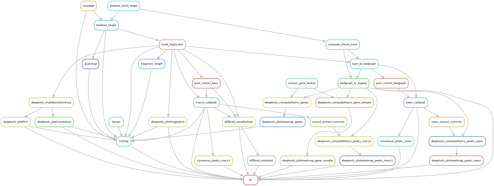

# CUT&RUN Snakemake pipeline

A Snakemake port of nf-core/cutandrun, structured the same way as the lab's
ATAC-Seq pipeline: a single `Snakefile`, all changeable inputs in
`config.yml`, conda envs in `envs/`, and a templated R/DiffBind Jupyter
notebook in `notebooks/`.



## Pipeline summary

1. **FastQC** on raw reads
2. **Cutadapt** adapter / quality trimming (Nextera + TruSeq adapters by default)
3. **Bowtie2** alignment to the target genome (CUT&RUN-tuned: `--end-to-end --very-sensitive --no-mixed --no-discordant -I 10 -X 700`)
4. Optional **Bowtie2** alignment to a spike-in genome (*E. coli* K12 carryover) → per-sample scale factor
5. **Qualimap** BAMQC + samtools flagstat / idxstats
6. Read filtering (`-F 1804 -f 2`, MAPQ ≥ `MIN_MAPQ`, optional blacklist subtraction)
7. **Picard MarkDuplicates** — duplicates removed for control samples; kept for targets by default
8. **Picard CollectInsertSizeMetrics** (fragment-length distribution)
9. BAM → **bedGraph** → **bigWig** (spike-in scaled if enabled, otherwise CPM)
10. Per-group control pooling — for each target group's CONTROLS list, merge replicate BAMs + average bedGraph
11. **MACS3** narrowPeak calling per target replicate (with assigned pooled control)
12. **SEACR** peak calling per target replicate (with assigned pooled bedGraph, or threshold mode)
13. Naive-overlap **consensus peaks** per target group, for both callers
14. **DeepTools**:
    - Gene-body heatmap (all target samples in one matrix; one matrix + heatmap per sample)
    - Peak-centered heatmap per sample (MACS3 summits, SEACR summits)
    - `multiBamSummary` → `plotCorrelation` (heatmap) + `plotPCA` over all BAMs
    - `plotFingerprint` per sample (enrichment QC)
15. **DiffBind** (R via parametrised Jupyter notebook):
    - Sample sheet generated automatically from `config.yml`
    - Occupancy heatmap, PCA, overlap rate, consensus peaks BED
    - Read counting at summits → normalisation → contrast → analysis
    - Per-contrast results CSV (full + FDR-filtered), MA, volcano, affinity heatmap
    - Full DBA object saved as RDS
16. **MultiQC** report aggregating FastQC, Cutadapt, Bowtie2, Picard, Qualimap, DeepTools QC, peak counts

## Repository layout

```
yablab_cutandrun_pipeline/
├── Snakefile
├── config.yml                       # all tunable parameters
├── samples_pe.json                  # sample → R1/R2 FASTQ mapping
├── envs/
│   ├── cutandrun_yablab.yml         # main pipeline env (bioinformatics tools)
│   └── diffbind.yml                 # R + DiffBind + Jupyter + papermill
├── notebooks/
│   └── diffbind_analysis.ipynb      # papermill-parameterised template
├── scripts/
│   ├── make_json_samples.py         # build samples_pe.json from a FASTQ folder
│   └── build_diffbind_samplesheet.py
├── workflow.png                     # rule DAG visualisation
└── README.md
```

## Inputs

### 1. Paired-end FASTQ files

Filenames must follow the pattern `<sample_id>.R1.fastq.gz` / `<sample_id>.R2.fastq.gz`.
Build the mapping with:

```bash
python scripts/make_json_samples.py /path/to/fastqs/*gz -o samples_pe.json
```

This produces `samples_pe.json` of the form:

```json
{
  "cond_1":  {"R1": ["/path/to/fastqs/Cond_1.R1.fastq.gz"],  "R2": ["/path/to/fastqs/Cond_1.R2.fastq.gz"]},
  "cond_2":  {"R1": ["/path/to/fastqs/Cond_2.R1.fastq.gz"],  "R2": ["/path/to/fastqs/Cond_2.R2.fastq.gz"]},
  ...
}
```

Each sample's `R1` / `R2` is a list, so multi-lane samples can be expressed by
listing multiple files (concatenated implicitly by Bowtie2).

### 2. Reference files

- `DNA` — target genome FASTA (uncompressed). Bowtie2 index is built into `OUTPUT/reference/target/`.
- `GTF` — annotation GTF. Used to extract gene bodies for the DeepTools gene-body heatmap. If your GTF lacks explicit `gene` features in column 3, AGAT reconstructs them automatically.
- `BLACKLIST` (optional) — BED of blacklisted regions; alignments overlapping these are removed.
- `SPIKEIN_FASTA` (optional) — only required when `USE_SPIKEIN: true`.

### 3. `config.yml` — all tunable parameters

| Section                  | Keys                                                                                                                       | Notes                                                                                          |
|--------------------------|----------------------------------------------------------------------------------------------------------------------------|------------------------------------------------------------------------------------------------|
| Reference                | `DNA`, `GTF`, `MITO_ID`, `BLACKLIST`                                                                                       | absolute paths; `BLACKLIST: ''` to skip                                                        |
| Spike-in                 | `USE_SPIKEIN`, `SPIKEIN_FASTA`, `SPIKEIN_SCALE_CONSTANT`                                                                   | scale = constant / spike-in-mapped reads                                                       |
| IO                       | `OUT_DIR`, `PE_SAMPLES_JSON`                                                                                               | output dir is created if missing                                                               |
| Sample grouping          | `GROUPS`, `CONTROLS`                                                                                                       | see [Controls](#controls)                                                                       |
| Trimming                 | `CUTADAPT_ADAPTERS`, `CUTADAPT_EXTRA`                                                                                      | defaults cover Nextera (Tn5) + TruSeq                                                          |
| Alignment                | `BOWTIE2_TARGET_PARAMS`, `BOWTIE2_SPIKEIN_PARAMS`                                                                          | Henikoff-lab defaults                                                                          |
| Filtering                | `MIN_MAPQ`, `REMOVE_DUPS_TARGETS`                                                                                          | controls always dedup'd; targets opt-in                                                        |
| MACS3                    | `MACS3_GSIZE`, `MACS3_QVALUE`, `MACS3_EXTRA`                                                                               |                                                                                                |
| SEACR                    | `SEACR_THRESHOLD`, `SEACR_MODE`, `SEACR_NORM`                                                                              | `stringent` / `relaxed`; `non` if bedGraphs are already spike-in scaled                        |
| DeepTools heatmaps       | `DT_BIN_SIZE`, `DT_REGION_BODY`, `DT_BEFORE_REGION`, `DT_AFTER_REGION`, `DT_PEAK_BEFORE`, `DT_PEAK_AFTER`                  | scale-regions for genes, reference-point for peaks                                             |
| DeepTools QC             | `DT_QC_BIN_SIZE`, `DT_QC_CORR_METHOD`, `DT_FINGERPRINT_SAMPLES`, `DT_FINGERPRINT_BINSIZE`                                  | `spearman` or `pearson`                                                                        |
| DiffBind                 | `DIFFBIND_PEAKCALLER`, `DIFFBIND_MIN_OVERLAP`, `DIFFBIND_FDR_THRESHOLD`                                                    | `macs3` (narrowPeak) or `seacr` (bed)                                                          |

## Controls

`CONTROLS` is a dict keyed by `GROUPS` name. Each entry lists the control
replicate IDs (must exist in `PE_SAMPLES_JSON`) that serve as that group's
control:

```yaml
CONTROLS:
  cond_1: [FL2]            # single rep — reused across all cond_1 target reps
  cond_2: [FL6, FL24]      # matched count — pooled into one cond_2 control
  cond_3: [FL10, FL28]
```

For each listed group, the replicates are pooled (merged BAM + mean
bedGraph) into a per-group control track at
`pooled_controls/<group>.pooled.{bam,bedgraph}` and used as the MACS3 / SEACR
control and the DiffBind `bamControl` for *that* group only. Sharing IgGs
across groups is fine — just list the same replicate ID under multiple
groups.

Groups omitted from `CONTROLS` (or with an empty list) run with no control:
MACS3 in no-control mode, SEACR falling back to `SEACR_THRESHOLD`.

## Outputs

All outputs land under `OUT_DIR/` (configured in `config.yml`). The structure
below is what you'll see after a successful run:

```
OUTPUT/
├── fastQC/                          # FastQC HTML + zip per read
├── trimmed_reads/                   # cutadapt-trimmed FASTQ + QC reports
├── reference/
│   └── target/                      # bowtie2 index, chrom_sizes.txt, genes.bed
├── Bowtie2/
│   ├── target/                      # *.csorted.bam (raw), *.filt.bam (filtered+dedup), *.flagstat, *.idxstats,
│   │                                # *.dupmark.metrics, *.insert_size_metrics.txt, *.insert_size_histogram.pdf,
│   │                                # <sample>/bamqc/ (Qualimap)
│   └── spikein/                     # only when USE_SPIKEIN=true
├── pooled_controls/                 # <group>.pooled.bam, <group>.pooled.bedgraph (one per group with controls)
├── BedGraph/                        # per-sample bedGraph (CPM or spike-in scaled)
├── BigWig/                          # per-sample bigWig (for IGV / heatmaps)
├── MACS3/
│   ├── <sample>/<sample>_peaks.narrowPeak     # MACS3 narrowPeak (replicate)
│   ├── <sample>/<sample>.summits.bed          # summit coordinates for heatmaps
│   └── <group>/finalPeakList.narrowPeak.gz    # naive-overlap consensus per group
├── SEACR/
│   ├── <sample>/<sample>.stringent.bed        # SEACR peaks (replicate)
│   ├── <sample>/<sample>.summits.bed
│   └── <group>/finalPeakList.bed.gz           # naive-overlap consensus per group
├── DeepTools/
│   ├── genes.matrix.gz, genes.heatmap.png                       # all-samples gene-body
│   ├── per_sample/
│   │   ├── genes/<sample>.{matrix.gz,heatmap.png}               # per-sample gene-body
│   │   ├── peaks_macs3/<sample>.{matrix.gz,heatmap.png}         # MACS3 summit-centred
│   │   └── peaks_seacr/<sample>.{matrix.gz,heatmap.png}         # SEACR summit-centred
│   └── qc/
│       ├── multiBamSummary.npz
│       ├── correlation.heatmap.png, correlation.matrix.tab      # plotCorrelation
│       ├── pca.png, pca.tab                                     # plotPCA
│       └── fingerprint/<sample>.{png,raw.tab,qcmetrics.tab}     # plotFingerprint
├── DiffBind/
│   ├── samplesheet.csv                                          # auto-generated
│   ├── diffbind_analysis.executed.ipynb                         # papermill output
│   ├── diffbind_analysis.html                                   # rendered notebook
│   ├── consensus_peaks.bed
│   ├── occupancy_{heatmap,pca,overlap_rate}.pdf
│   ├── affinity_{pca,heatmap_correlation}.pdf
│   ├── contrast_NN_<grp1>_vs_<grp2>_{results.csv,significant_FDR0.05.csv,MA.pdf,volcano.pdf,affinity_sig_heatmap.pdf}
│   └── dba_analysis.rds                                         # full DBA object for re-analysis
├── MultiQC/multiqc_report.html
├── Logs/                                                        # one subdir per rule
└── Benchmarks/                                                  # per-rule TSV runtime stats
```

## Quickstart

```bash
conda activate snakemake

# 1) Build the samples JSON from a folder of *.R1.fastq.gz / *.R2.fastq.gz
python scripts/make_json_samples.py /path/to/fastqs -o samples_pe.json

# 2) Edit config.yml — at minimum: DNA, GTF, OUT_DIR, PE_SAMPLES_JSON, GROUPS, CONTROLS

# 3) Dry run to verify the rule graph
snakemake -n --use-conda

# 4) Run
snakemake --use-conda -j 16
```

First run will solve and build two conda envs (`cutandrun_yablab` and
`diffbind`); subsequent runs reuse them.

## Re-running the DiffBind notebook interactively

The pipeline runs `notebooks/diffbind_analysis.ipynb` via `papermill` and
writes the executed copy to `OUTPUT/DiffBind/`. To iterate on the analysis
without re-running the pipeline:

```bash
conda activate diffbind
jupyter notebook OUTPUT/DiffBind/diffbind_analysis.executed.ipynb
```

The notebook's parameters cell already references your generated samplesheet,
output dir, and thresholds — adjust contrasts, add annotation, or change
plots, and re-run interactively. The original template at
`notebooks/diffbind_analysis.ipynb` is unmodified.
