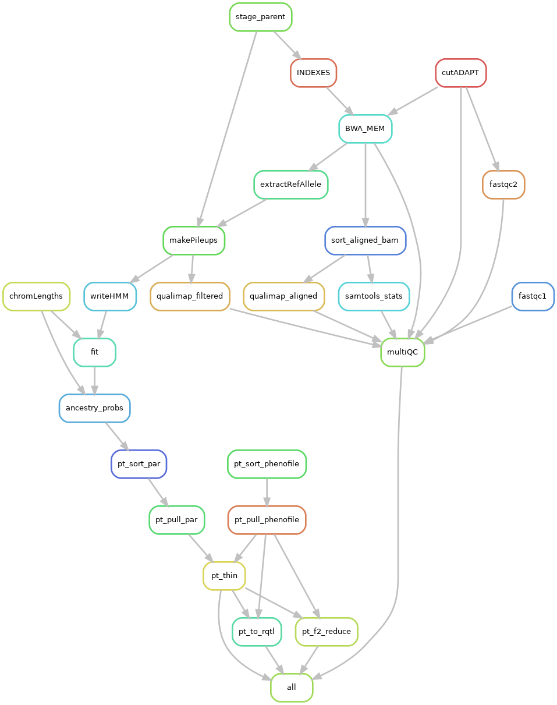

# Multiplexed Shotgun Genotyping (MSG) Snakemake pipeline

A Snakemake re-implementation of the **Multiplexed Shotgun Genotyping (MSG)**
pipeline (Andolfatto et al. 2011), rebuilt rule-by-rule on Python 3 with native
paired-end support, modern conda-managed dependencies, and configurable
parameters.

The original MSG pipeline is a Perl/Python 2.7 codebase that aligns parental
re-sequencing reads against two parental references, calls per-marker
ancestry probabilities with an HMM, and emits genotype tables for downstream
linkage / QTL mapping. This version preserves the core HMM logic but
modernizes everything around it.

## Workflow



## Layout

```
.
├── Snakefile             # modernized DAG (rename to Snakefile when ready)
├── config.yml            # all tunable parameters (paths + knobs)
├── workflow2.png         # rule graph
├── envs/
│   ├── msg_py3.yml       # bwa, samtools, pysam, biopython, numpy, pyfaidx,
│   │                     # fastqc, qualimap, multiqc  (Python 3.11)
│   └── r_msg_v2.yml      # R env for HMM fit + ancestry-probs
└── scripts/
    ├── extract_ref_alleles.py   # PE-aware reference-allele extraction (py3)
    ├── write_hmm_data.R         # per-contig HMM input builder
    ├── fit_hmm.R                # HMM fit (uses hmmprobs binary)
    ├── hmmlib.R                 # HMM helpers (sourced by fit_hmm.R)
    ├── ded.R                    # numerical helpers
    ├── breakpoint-widths.R      # optional breakpoint-width analysis
    ├── hmmprobs                 # compiled C binary, called from R
    ├── ancestry_probs.R         # per-sample → cohort ancestry table
    ├── sort_indivs.py           # natural-sort individuals across TSVs
    ├── _natsort.py              # natural-sort key (used by sort_indivs.py)
    ├── pull_indivs.py           # subset individuals by config
    ├── thin_markers.py          # marker thinning (diffac / num_markers)
    ├── f2_reduce_prob_slots.py  # F2 X-chrom prob-slot conversion
    └── tsv_to_rqtl.py           # emit r/qtl-compatible CSV
```

## How to run

```bash
conda activate snakemake
snakemake -s Snakefile -n              # dry-run
snakemake -s Snakefile --use-conda -c8 # execute
```

All paths and knobs live in `config.yml`. The two parental references are
addressed positionally (`par1` / `par2`), so the DAG is parent-agnostic —
swap genomes by editing `config.yml`, no rule edits needed.

## What changed vs. the original MSG pipeline

### Python 2 → Python 3
- `extract_ref_alleles.py` rewritten on Python 3.11 / pysam ≥ 0.22 / biopython ≥ 1.83.
- All other Python helpers (`sort_indivs.py`, `pull_indivs.py`, `thin_markers.py`,
  `f2_reduce_prob_slots.py`, `tsv_to_rqtl.py`) are new Python 3 implementations
  of stages that were previously Perl one-liners or inline shell pipelines.
- Legacy env (`envs/msg.yml`, pinned to `python=2.7`, `biopython=1.76`,
  `samtools=0.1.9`) is no longer used.

### Paired-end first
- Original MSG was single-end (`bwa aln` + `samse`). v2 uses `bwa mem` on
  R1+R2 with `-M` and a samtools name-sort piped directly into the BAM.
- `extract_ref_alleles.py` walks read pairs (qname-sorted BAMs) and applies
  the AS−XS repeat threshold to **each mate** — a pair is kept only if both
  mates pass against at least one parent.

### Configurable parameters (no more hard-coded values)
Everything previously hard-coded in scripts is now in `config.yml`:
- `extract_ref.chroms` / `extract_ref.repeat_threshold`
- `bwa_mem.extra` (passed verbatim to `bwa mem`)
- `fit_hmm.*` — sex, deltapar1/2, recRate, rfac, theta, prior, sexchrom,
  gff_thresh_conf, one_site_per_contig, chroms2plot, pepthresh, diffac
- `fit_hmm.cross` — `bc` (backcross) or `f2`; the DAG branches automatically
- Marker-thinning knobs: `thinfac`, `pna_thresh`, `num_markers`, `ignore_nan`,
  `autosome_prior`, `x_prior`, `indivs`
- `breakpoint_widths` / `plot_correlation_matrix` gate optional heavy stages

### F2 support
- New `pt_f2_reduce` rule produces F2-compatible probability slots on the
  X chromosome.
- `tsv_to_rqtl.py` emits an r/qtl CSV for either `bc` or `f2` crosses
  directly from the thinned ancestry tables.

### Native Snakemake DAG (not a wrapper around legacy scripts)
- Each stage is a real Snakemake rule with `input`/`output`/`log`/`benchmark`/
  `conda`/`threads`/`resources` declarations — this gives proper
  parallelization, partial-failure resumption, and provenance tracking.
- Uses Snakemake wrappers where appropriate (`v3.10.2/bio/cutadapt/pe`).
- Per-rule conda envs (`--use-conda`) replace the original "activate one big
  env and pray" model.

### QC consolidated through MultiQC
- New `fastqc1` (raw) and `fastqc2` (post-trim) rules, plus per-BAM
  `qualimap_aligned` / `qualimap_filtered` and `samtools_stats`
  (flagstat / stats / idxstats), all collated into a single
  `MultiQC/multiqc_report.html` by the `multiQC` rule.

### Single consolidated env
- The legacy DaGRP env has been retired. `envs/msg_py3.yml` now carries every
  non-R dependency (bwa, samtools, pysam, biopython, numpy, pyfaidx, fastqc,
  qualimap, multiqc). R-side work uses `envs/r_msg_v2.yml`.

## Notes on porting into the legacy repo

- This bundle expects to sit alongside (or replace) the legacy `Snakefile`.
  Rename `Snakefile` → `Snakefile` once you're ready to retire v1.
- `config.yml` keys overlap with the legacy config but add new sections
  (`extract_ref`, `bwa_mem`, expanded `fit_hmm`). Merge rather than overwrite
  if the legacy config has site-specific paths you want to keep.
- `scripts/hmmprobs` is a compiled binary; copy it across as-is (do **not**
  re-compile from the legacy MSG source — the v2 R code calls it with the
  same CLI as the legacy build).
- The legacy `envs/DaGRP.yml`, `envs/msg.yml`, `envs/r_msg.yml`, and
  `envs/samtool_0.1.9.yml` are no longer referenced and can be removed once
  the v1 Snakefile is retired.
